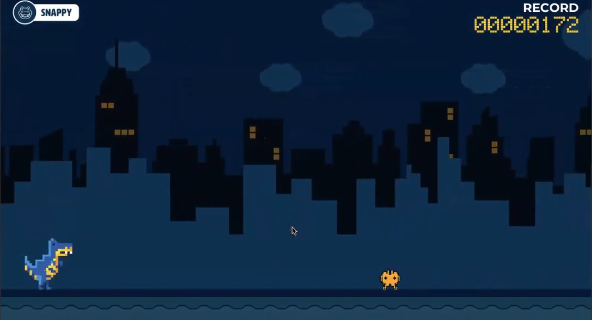

# CHROME DINO COM UNITY
👨‍🏫PROJETO CRIADO PARA O CURSO DE UNITY.

   

## DESCRIÇÃO:
**Chrome Dino**, também conhecido como **"Dino Game"** ou **"T-Rex Runner"**, é um jogo oculto do navegador Google Chrome que aparece quando você está offline e tenta acessar uma página da web. O objetivo do jogo é controlar um dinossauro T-Rex em um ambiente desértico, correndo e pulando obstáculos como cactos e pássaros. O jogo tem um estilo retrô de 8 bits e se destaca por sua simplicidade e diversão. Ele aumenta a dificuldade gradualmente, fazendo com que o jogo se torne mais desafiador à medida que o jogador avança.

## IMPORTANDO PARA A UNITY:
- **Método 1. **Importar o Código e Assets:**
   - **Método 1: Importar via Asset Package**
     1. **Verifique o Código e Assets:**
        - Se o repositório GitHub contém um arquivo `.unitypackage`, você pode importar diretamente para o Unity.
        - Se o repositório não tem esse arquivo, você precisará copiar o código e assets manualmente.

     2. **Importar o `.unitypackage`:**
        - No Unity, vá para `Assets` > `Import Package` > `Custom Package`.
        - Navegue até o arquivo `.unitypackage` que você baixou e selecione-o.
        - Clique em `Import` para adicionar o conteúdo ao seu projeto.

- **Método 2: Copiar e Colar Manualmente**
     1. **Copiar o Código e Assets:**
        - Extraia o conteúdo do repositório GitHub (se ainda não o fez) em uma pasta no seu computador.
        - Navegue até a pasta `Assets` do seu projeto Unity (normalmente localizada na raiz do diretório do projeto Unity).

     2. **Adicionar o Conteúdo ao Projeto:**
        - Copie a pasta contendo o código e assets do repositório GitHub.
        - Cole a pasta na pasta `Assets` do seu projeto Unity. O Unity reconhecerá e importará automaticamente os arquivos.

2.**Configurar o Projeto no Unity:**
    1. **Abrir a Cena Principal:**
    - No painel `Project`, vá para a pasta onde o código e assets foram importados. Procure por uma cena principal, normalmente chamada `MainScene`, `GameScene`, ou algo semelhante.
    - Clique duas vezes na cena para abri-la.
    2. **Verificar e Ajustar Configurações:**
    - Certifique-se de que todos os scripts, prefabs e outros assets foram importados corretamente.
    - Se houver scripts que precisam de referências, você pode precisar arrastar e soltar esses objetos no `Inspector` para configurar as referências corretamente.
    3. **Adicionar Configurações Adicionais:**
    - Se o código exigir configurações específicas ou componentes adicionais, siga as instruções fornecidas no repositório GitHub. Verifique o README.md ou qualquer documentação que venha com o código.

## CREDITOS:
- [PROJETO CRIADO PARA O CURSO DE UNITY](https://github.com/VILHALVA/CURSO-DE-UNITY)
- [PROJETO EDITADO PELO VILHALVA](https://github.com/VILHALVA)
